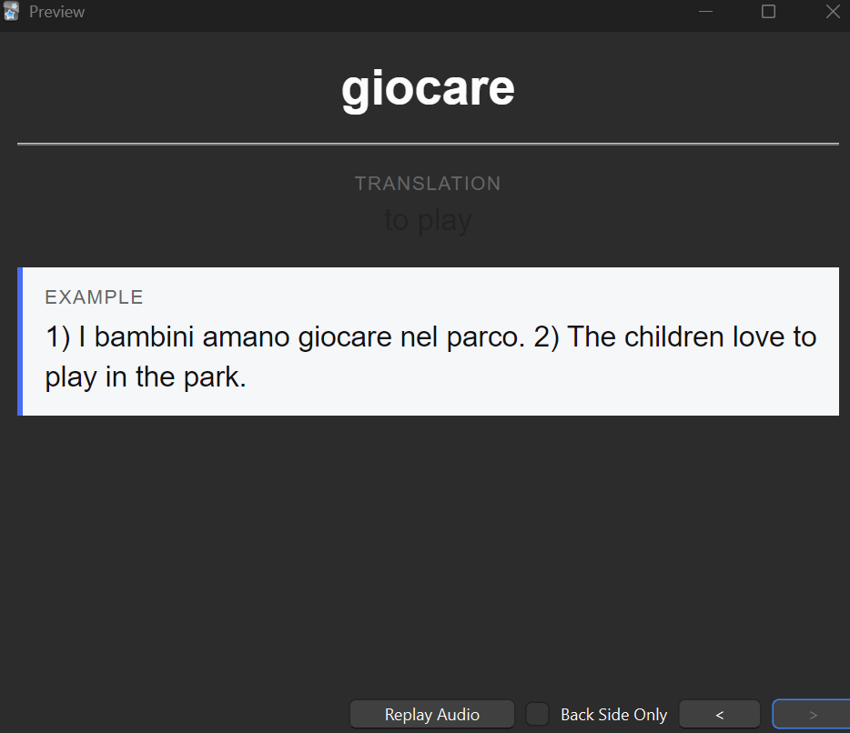

# Anki LLM Vocabulary Add-on (Open Source EdTech)

An open-source **Education Technology (EdTech)** add-on for **Anki Desktop** that assists vocabulary flashcard creation using large language models (LLMs), while preserving **active recall** and **spaced repetition**.

You enter a word, choose a source and target language, and click **Generate**.  
The add-on fills a concise translation and a clear example sentence.  
Review and memorization are handled entirely by Anki.

---

## Why this add-on

The goal is **lean learning**:

- reduce friction during card creation
- keep cognitive effort during review
- avoid over-automation

The LLM is used **only at creation time**, never during review.

---

## Features

- One-click vocabulary generation
- Source and target language dropdowns
- Clean, distraction-free card design
- Theme-aware styling (light and dark mode)
- Fully compatible with Anki’s spaced repetition
- Open source and transparent

---

## Example workflow

### 1. Before generation
Choose the source and target language and enter a word.

---

### 2. After generation
After pressing **Generate**, the translation and example are filled automatically.

---

### 3. Card preview
The card shows the word on the front and reveals the translation and example on the back.

---

## Recommended card format (best experience)

For the best user experience, this project provides a **ready-made Anki note type**
with optimized fields, card templates, and theme-aware styling.

- **Front:** Word only  
- **Back:** Translation + Example

The note type is distributed as:

